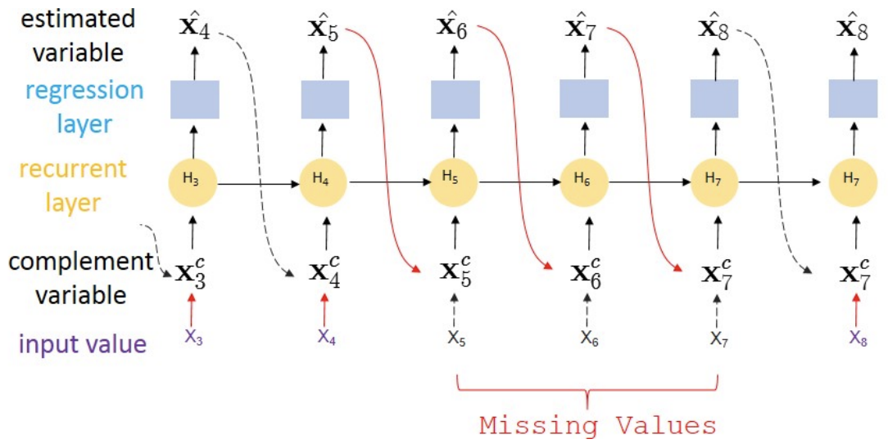
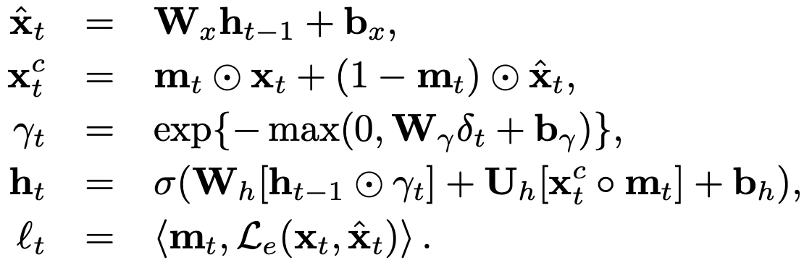
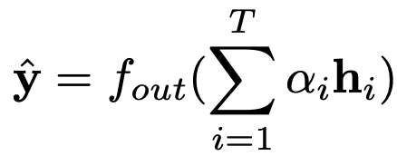
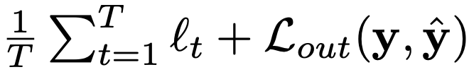
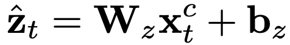
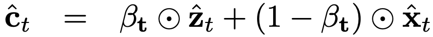
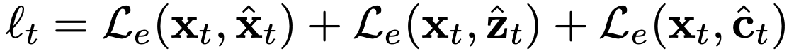
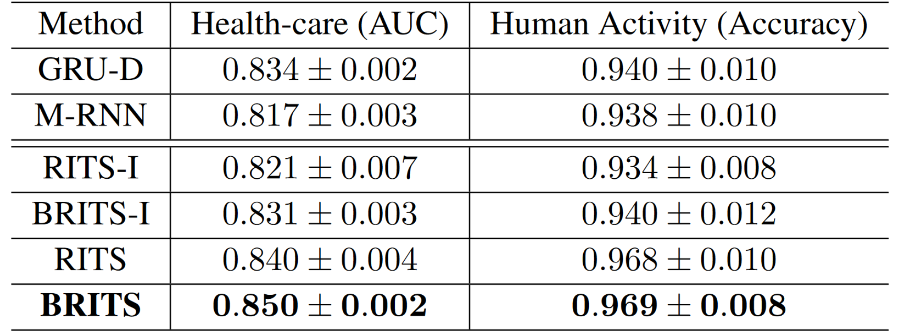

# Projet EDTS - BRITS

**Article presenté :** [BRITS: Bidirectional Recurrent Imputation for Time Series](http://papers.nips.cc/paper/7911-brits-bidirectional-recurrent-imputation-for-time-series.pdf).

**Par :** Wei Cao, Dong Wang, Jian Li, Hao Zhou, Yitan Li et Lei Li

**Presenté par :** [Hugo Lerogeron](https://github.com/Slyser) et [Salim Talout Zitan](https://github.com/salimtalout)

**Code source du projet :** [salimtalout/BRITS](https://github.com/salimtalout/BRITS) (Fork de [ce projet](https://github.com/caow13/BRITS))

## Introduction

Le but de ce papier est d'apporter une méthode de prédiction de données sur des séries de données temporelles (Multivariate time series, ou MTS). Les MTS sont largement utilisées dans de nombreux secteurs tels que la médecine, la finance, ou encore la météorologie. Il est commun que des données soient manquantes dans ces MTS, et cela peut être dû à plusieurs facteurs, comme un disfonctionnement des capteurs, ou encore une erreur de communication. Cela peut être problématique et il est nécessaire de pouvoir compléter ces données manquantes.
Pour ce faire, plusieurs méthodes sont proposées.

## Partie théorique

### Multivariate Time Series

Avant d'aborder les méthodes utilisées pour résoudre la problématique, définissons les MTS.

Une MTS est une séquence de T observations telle que , avec  comportant  features .

Puisque  peut avoir des valeurs manquantes, on introduit un vecteur  tel que :

1 si on a une observation, 0 sinon.

### RITS-I

Afin de surpasser les modèles RNN déjà existants, on utilise une méthode qui s’appelle RITS-I, qui se base sur des réseaux de neurones récurrents.

Pour cette méthode, supposons qu’à l’étape ,  et  sont pas corrélés pour .

À l’étape t, si  est observé, on l’utilise pour valider l'imputation, et donc mettre à jour les poids du réseau. Dans le cas contraire, étant donné que les futures observations sont corrélées avec la valeur actuelle, on remplace  par l'imputation obtenue, et on la valide grâce aux observations suivantes.

#### Algorithme

Tout d'abord,  on calcule l’estimation .
Ensuite, on calcule , qui prend  dans le cas où l’on a la mesure, ou  sinon.
Étant donné que les valeurs sont manquantes de manière irrégulière, on introduit , qui indique les valeurs manquantes.
On prédit l’état  en fonction des étapes précédentes.
Ensuite, on calcule l’erreur estimée à partir de l’erreur absolue moyenne.

Enfin, on obtient la prédiction .

On fait ensuite la mise à jour en minimisant la loss accumulée.

#### Problèmes engendrés

Les principaux problèmes de cette méthode sont que les erreurs sur les valeurs manquantes ne sont obtenues jusqu’à l’observation suivante. Donc cela induit une convergence moins rapide, mais aussi des performances diminuées pendant l’entraînement.

La solution serait donc de ne pas seulement passer par l’observation suivante, mais aussi par l’observation précédente. C’est ce qu’ils ont appelé BRITS-I

### BRITS-I

Donc le but de cette méthode est simplement de faire un RITS-I, mais dans les deux sens. 

En forward, on estime une séquence et on a la loss pour cette séquence là (pareillement en backward).

* En forward :
	* Estimation :  
	* Loss : 
* En backward :
	* Estimation : 
	* Loss : 

On introduit un *consistency loss*, qui est en fait la différence entre l’estimation  et l’estimation  à une étape t : .

Ensuite, le loss final sera l’accumulation et loss en backward, forward et aussi la consistency loss.

Et enfin, l’estimation finale sera la moyenne entre l’estimation backward et forward.

### RITS et BRITS

On a donc pû voir que l’on peut estimer les valeurs manquantes en regardant l’historique, non seulement dans un sens, mais aussi dans l’autre.
Mais dans ces deux cas, on a considéré le fait que deux mesures à un temps  ne sont pas corrélées.

Or, nombreux exemples nous montrent le contraire. La météo entre Rouen est Paris est assez proche à un instant , et cela est dû à la proximité spatiale.
Sauf que les méthodes RITS-I et BRITS-I ne prennent pas cela en compte.
L’idée, pour les prochaines méthodes, RITS et BRITS, est d’estimer grâce à l’historique des mesures, mais aussi grâce aux mesures voisines.

#### Répercutions sur l’algorithme

Donc dans l’algorithme, cela se traduit par l’ajout d’une estimation qui dépend des autres features (mesures voisines).

Ainsi, il faut ajouter une estimation qui combine les deux autres :  l’estimation qui dépend de l’historique, mais aussi celle qui dépend des mesures voisines.

Enfin, il faut modifier l’erreur estimée, pour qu’elle prenne en compte ces deux nouvelles estimations.

## Partie expérimentale

Le papier étant assez techniquement avancé, et puisque l'équipe de chercheurs a lié son papier au github implémentant les techniques développées dans l'algorithme, nous avons utilisé leur git pour nos tests.

L'utilisation du git est assez simple. Pour entraîner un des modèles type RNN comme le RITS-I, on entre simplement la commande suivante:

`python main.py --model rits_i --epochs 1000 --batch_size 64 --impute_weight 0.3 --label_weight 1.0 --hid_size 108`

Le modèle s'entraîne ensuite sur les différents jeux de données énoncés dans le papier avant de donner les résultats en test selon les tâches choisies. Selon les modèles, ces tâches sont de remplir les données manquantes et de faire de la classification ou non.

### Le code

L'import des données, la définition de l'architecture et l'entraînement des réseaux de neurones et le calcul des métriques de résultat sont faites grâce à l'excellente bibilothèque _PyTorch_.

#### L'import des données

Cette partie est effectuée dans le module _data_loader_ . Via la module _DataLoader_ de _PyTorch_, on transforme les données stockées sous format _json_ vers un _Loader_. Celui ci permet de ne charger en mémoire que les données que l'on va utiliser par la suite, et fonctionne donc très bien avec des optimiseurs utilisant le principe de la _Stochastic Graident Descent_. Les _DataLoader_ sont des objets contenant les _Tensors_, type de _PyTorch_ semblables au _nparrays_ de _Numpy_, mais permettant d'être mis à jour via descente de gradient.

#### Les classificateurs

On compare d'abord les résultats obtenus via BRITS à ceux obtenus via techniques de _Machine Learning_ plus classiques. Celles ci sont implémentées dans le module _baseline_ via la librairie _fancyimpute_ et contiennent une simple moyenne, moyenne via _KNN_, _MICE_, _ImputTS_ et _STMVL_.

Les modèles basés sur des LSTMs, c'est à dire m_rnn, gru_d, rits_i, rits, brits_i et brits sont définis dans /models. Via _PyTorch_ on définit leur architecture en définissant une par une les couches du modèle, avant de définir comment les poids sont mis à jour dans les méthodes forward et backward, mais aussi comment les estimations sont mises à jour dans la méthode reverse.

#### L'entraînement

Les modèles de _Machine_Learning_ classique sont entraînés via la librairie _fancyimpute_ directement. Pour les modèles type _rnn_, on définit dans le modèle la manière dont il s'entraîne. Le reste est définit dans le main: l'optimiseur choisi est _Adam_, ainsi que le _batch_size_ et les fonctions affichant le déroulement de l'entraînement.

#### La mesure de performance

La mesure de performance est effectuée dans le _main_. Elle se base principalement sur deux métriques: la _Mean Average Error_ _MAE_  et la _Mean Relative Error_ _MRE_ .

### Jeu de données

Les modèles sont évalués sur 3 datasets.

* Air Quality: Mesures de la qualité de l'air faite à Pékin. 13.3% des données sont manquantes.
* Healthcare data: Données à 4000 variables contenant les informations biologiques de patient en salle d'opérations. 78% des valeurs sont manquantes, les données sont donc extrêmement creuses. La tache de prédiction consiste à déterminer si le patient survit ou non à l'opération.
* Human Activity: Mesures de capteurs sur des humains effectuant des tâches quotidiennes. La tâche de prédiction consiste à déterminer l'action en cours.

### Résultats

Voici les résultats obtenus par les différents algorithmes sur les jeux de données décrits au dessus:

Ici, la tâche est simplement la recréation des jeux de données en remplissant les trous dans les jeux de données. Les métriques sont _MAE_ et _MRE_ en pourcentage.

On remarque que, sans surprises, remplacer en faisant simplement la moyenne est très mauvais. C'est un peu mieux si on choisit les K plus proches voisins et qu'on fait la moyenne avec. De plus, BRITS est le meilleur modèle sur tous les jeux de données, battant l'ancien état de l'art _STMVL_ sur le jeu de données "Air Quality" et écrasant les solutions _baseline_ sur les autres jeu de données. Enfin BRITS dépasse BRITS-I sur tous les jeux, mais est parfois très proche comme sur le jeu "Air Quality" pouvant illustrer que les données ne sont pas spatialement corréllées pour ce jeu de données.

Enfin, même pour les tâches de classification, BRITS est le meilleur algortihme, validant la méthode.

## Conclusion

Les tests expérimentaux valident l'intêret de la méthode BRITS: celle ci obtient en effet de meilleures performances que toutes les autres méthodes testées sur les 3 jeux de données. Il conviendra cependant de faire valider cette méthode sur d'autres jeux de données.
