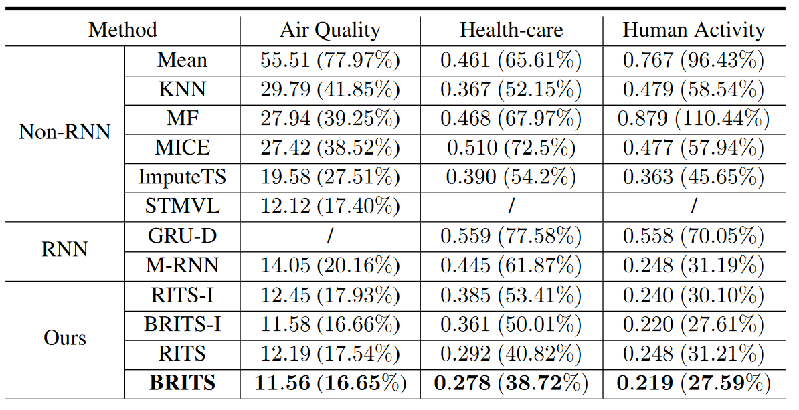
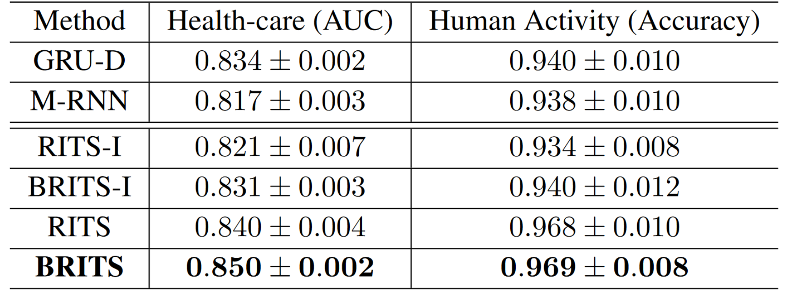

# Projet EDTS - BRITS

## Partie theorique

## Partie experimentale

Le papier étant assez techniquement avancé, et puisque l'équipe de chercheurs a lié son papier au github implémentant les techniques développées dans l'algorithme, nous avons utilisé leur git pour nos tests. 

L'utilisation du git est assez simple. Pour entraîner un des modèles type RNN comme le RITS-I, on entre simplement la commande suivante: 

`python main.py --model rits_i --epochs 1000 --batch_size 64 --impute_weight 0.3 --label_weight 1.0 --hid_size 108`

Le modèle s'entraîne ensuite sur les différents jeux de données énoncés dans le papier avant de donner les résultats en test selon les tâches choisies. Selon les modèles, ces tâches sont de remplir les d'onnées manquantes et de faire de la classification ou non. 

### Le code
L'import des données, la définition de l'architecture et l'entraîneemnt des réseaux de neurones et le clacul des métriques de résultat sont faites grâce à l'excellente bibilothèque _PyTorch_. 

#### L'import des données:
Cette partie est effectuée dans le module _data_loader_ . Via la module _DataLoader_ de _PyTorch_, on transforme les données stockées sous format _json_ vers un _Loader_. Celui ci permet de ne charger en mémoire que les données que l'on va utiliser par la suite, et fonctionne donc très bien avec des optimiseurs utilisant le principe de la _Stochastic Graident Descent_. Les _DataLoader_ sont des objets contenant les _Tensors_, type de _PyTorch_ semblables au _nparrays_ de _Numpy_, mais permettant d'être mis à jour via descente de gradient. 

#### Les classificateurs:
On compare d'abord les résultats obtenus via BRITS à ceux obtenus via techniques de _Machine Learning_ plus classiques. Celles ci sont implémentées dans le module _baseline_ via la librairie _fancyimpute_ et contiennent une simple moyenne, moyenne via _KNN_, _MICE_, _ImputTS_ et _STMVL_. 

Les modèles basés sur des LSTMs, c'est à dire m_rnn, gru_d, rits_i, rits, brits_i et brits sont définis dans /models. Via _PyTorch_ on définit leur architecture en définissant une par une les couches du modèle, avant de définir comment les poids sont mis à jour dans les méthodes forward et backward, mais aussi comment les estimations sont mises à jour dans la méthode reverse.

#### L'entraînement: 
Les modèles de _Machine_Learning_ classique sont entraînés via la librairie _fancyimpute_ directement. Pour les modèles type _rnn_, on définit dans le modèle la manière dont il s'entraîne. Le reste est définit dans le main: l'optimiseur choisi est _Adam_, ainsi que le _batch_size_ et les fonctions affichant le déroulement de l'entraînement. 

#### La mesure de performance:
La mesure de performance est effectuée dans le main. Elle se base principalement sur deux métriques: la _Mean Average Error_ _MAE_ et la _Mean Relative Error_ _MRE_.

### Jeu de données:

Les modèles sont évalués sur 3 datasets. 

 * Air Quality: Mesures de la qualité de l'air faite à Pékin. 13.3% des données sont manquantes. 
 * Healthcare data: Données à 4000 variables contenant les informations biologiques de patient en salle d'opérations. 78% des valeurs sont manquantes, les données sont donc extrêmement creuse. La tache de prédiction consiste à déterminer si le patient survit ou non à l'opération. 
 * Human Activity: Mesures de capteurs sur des humains effectuant des tâches quotidiennes. La tâche de prédiction consiste à déterminer l'action en cours. 

### Résultats:
Voici les résultats obtenus par les différents algorithmes sur les jeux de données décrits au dessus:

 
 
 Ici, la tâche est simplement la recréation des jeux de données en remplissant les trous dans les jeux de données. Les métriques sont _MAE_ et _MRE_ en pourcentage. 
 
 On remarque que, sans surprises, remplacer en faisant simplement la moyenne est très mauvais. C'est un peu mieux si on choisit les K plus proches voisins et qu'on fait la moyenne avec. De plus, BRITS est le meilleur modèle sur tous les jeux de données, battant l'ancien état de l'art _STMVL_ sur le jeu de données "Air Quality" et écransant les solutions _baseline_ sur les autres jeu de données. Enfin BRITS dépasse BRITS-I sur tous les jeux, mais est parfois très proche comme sur le jeu "Air Quality" pouvant illustrer que les données ne sont pas spatialement corréllées pour ce jeu de données. 
 
 Enfin, même pour les tâches de classification, BRITS est le meilleur algortihme, validant la méthode. 
 
 
 
 ## Conclusion: 
 Les tests expérimentaux valident l'intêret de la méthode BRITS: celle ci obtient en effet de meilleurs performances que toutes les autres méthodes testées sur les 3 jeux de données. Il conviendra cependant de faire valider cette méthode sur d'autres jeux de données. 
